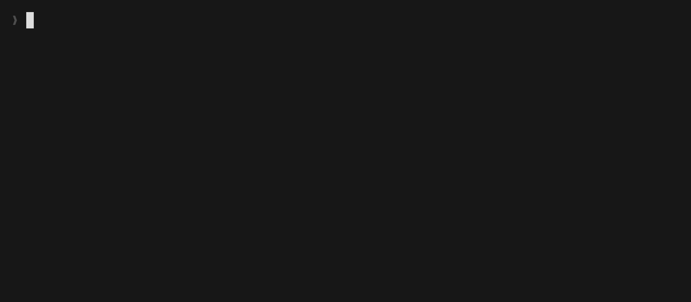

<div align="left">

# feago

**Feature-first Rojo project generator for Roblox.**


</div>



## Why feago

Realm-first layouts (`src/server/`, `src/client/`, `src/shared/`) scatter one feature across three folders. Open a feature, jump three places.

feago lets you keep everything for a feature in its own folder, mixed realms and all, and works out the Rojo project file from there.

## Quickstart

```sh
rokit add afrxo/feago
feago init && feago watch
```

## Install

**Rokit** (per-project, recommended):

```sh
rokit add afrxo/feago
```

**Homebrew** (macOS, global):

```sh
brew install --cask afrxo/tap/feago
```

**Prebuilt binary:** [releases page](https://github.com/afrxo/feago/releases).

## How realm gets decided

For each `.luau` file, feago checks in order, stopping at the first match:

1. Filename suffix, same as Rojo: `*.server.luau`, `*.client.luau`.
2. First-line directive: `--@load:server`, `--@load:client`, `--@load:shared`, `--@load:preload`.
3. Closest `.feago` folder config walking up the tree.
4. Default: shared.

> [!IMPORTANT]
> A directive beats the filename suffix. `*.client.luau` with `--@load:preload` on the first line maps to preload (`ReplicatedFirst`), not client.

Realms map to services:

| Realm   | Rojo destination                |
|---------|---------------------------------|
| Server  | `ServerScriptService`           |
| Client  | `ReplicatedStorage/Client`      |
| Shared  | `ReplicatedStorage/Shared`      |
| Preload | `ReplicatedFirst`               |

> [!NOTE]
> These destinations are hardcoded for now. Making them configurable per project is planned.

### The `.feago` folder config

Drop a `.feago` file into a folder to set the default realm for every `.luau` under it. Per-file suffixes and directives still win.

```ini
# src/inventory/.feago
realm = shared
```

Valid values: `server`, `client`, `shared`, `preload`. Lines starting with `#` are comments.

> [!CAUTION]
> Folder default loses to per-file overrides. A stray `combat.server.luau` inside a folder with `realm = client` still goes to the server.

## Commands

- **`feago init [dir] [--force]`**: scaffold a project
- **`feago build [source] [--project <file>]`**: build once
- **`feago watch [source] [--project <file>]`**: rebuild on changes
- **`feago version`**: print version
- **`feago help [command]`**: show help

Run `feago help <command>` for full usage.

## Contributing

Open an [issue](https://github.com/afrxo/feago/issues) for bugs, ideas, or design discussion before a PR.

Build locally with `go build ./cmd/feago`. There are no tests yet, so if you want to add some, even better.

## License

MIT. See [LICENSE](LICENSE).
